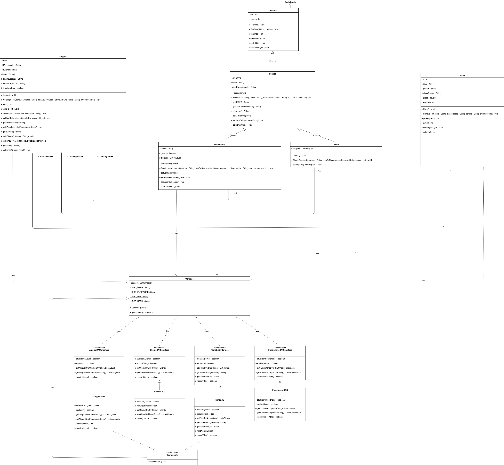

# Loucadora
## Um pequeno sistema para gerir locadoras extintas

Primeiramente é criar criar uma base de dados para alocar os valores de filme, aluguel, cliente e funcionário. O arquivo com o script para o banco de dados se chama “locadora.sql”.

Ao executar o programa, uma tela inicial irá aparecer com opções para o usuário, algumas necessitam da permissão de um funcionário que seja gerente. As opções que apenas gerentes podem fazer são: inserir cliente, excluir cliente ou funcionário, alterar algum dado em alguma tabela (não sei se to esquecendo algo).
